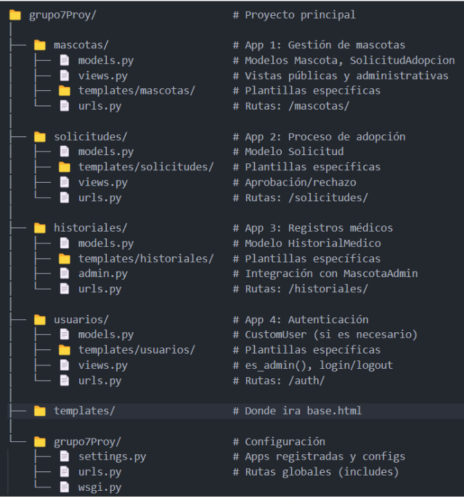
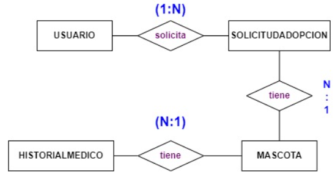

# 📚Proyecto Django - Sistema de Adopción de Mascotas 
<h1 align = "center">
  
</h1>

## Descripción

Sistema de Adopción de Mascotas es una aplicación web desarrollada con Django que permite gestionar el proceso de adopción de mascotas. La plataforma facilita la conexión entre personas que desean adoptar y mascotas que necesitan un hogar, además de proporcionar herramientas para la gestión de historiales médicos y solicitudes de adopción.

## Características

- 🐾 Catálogo de mascotas disponibles para adopción
- 👤 Sistema de registro y autenticación de usuarios
- 📝 Gestión de solicitudes de adopción
- 📋 Historiales médicos de las mascotas
- 👨‍💼 Panel de administración para gestores
- 📊 Visualización de datos con DataTables (configurado en español)

## Estructura del Proyecto

El proyecto está organizado en cuatro aplicaciones principales:

### 1. Aplicación `usuarios` 👤

- **Modelo**: `Usuario` (extiende AbstractUser)
- **Funcionalidades**: Registro, login, perfil de usuario, panel de administración
- **Archivos**: models.py, views.py, forms.py, urls.py, admin.py, apps.py
- **Templates**: login.html, registro.html, perfil.html, panel_admin.html

### 2. Aplicación `mascotas` 🐶🐱🐹🐰

- **Modelo**: `Mascota`
- **Funcionalidades**: Listado, detalle, gestión de mascotas (CRUD)
- **Archivos**: models.py, views.py, forms.py, urls.py, admin.py, apps.py
- **Templates**: inicio.html, detalle.html, gestionar.html, agregar.html, editar.html

### 3. Aplicación `solicitudes`  📩

- **Modelo**: `SolicitudAdopcion`
- **Funcionalidades**: Solicitar adopción, listar solicitudes, gestionar solicitudes
- **Archivos**: models.py, views.py, forms.py, urls.py, admin.py, apps.py
- **Templates**: solicitar.html, mis_solicitudes.html, gestionar.html

### 4. Aplicación `historiales` 📂

- **Modelo**: `HistorialMedico`
- **Funcionalidades**: Listar historiales médicos, agregar historiales, filtrar por especie/mascota
- **Archivos**: models.py, views.py, forms.py, urls.py, admin.py, apps.py
- **Templates**: lista.html, agregar.html


## ✅ Requisitos

- Python 3.X o superior
- Django 3.2+
- pip
- Entorno virtual (recomendado)
- Otras dependencias en `requirements.txt`

## Pasos para la instalación

1. Clonar el repositorio
```
git clone <URL-del-repositorio>
 cd avance_proyecto
 ```
2. Crear y activar el entorno virtual
```
#En windows
python -m venv env
env\Scripts\activate

```
3. Instalar las dependencias
```
pip install -r requirements.txt
cd grupo7Proy
## ⚙️ Configurar la base de datos
```
4. Ejecutar migraciones
```  
py \manage.py makemigrations  
py \manage.py migrate

 ```
## 🖥️ Ejecutar el servidor
```  
py \manage.py runserver
```
`<Visita>` : <http://127.0.0.1:8000/>
---
## 🔐Acceso al panel de Administración
Puedes acceder al padel de administración de Django en:
`<link>` : http://127.0.0.1:8000/admin/

---
## 🌐Estructura base
<h1 align = "center">
  
</h1>
## ⛓️‍💥 Diagrama Base de Datos
<h1 align = "center">
  
</h1>


##END
